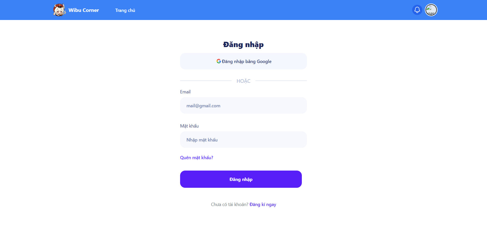
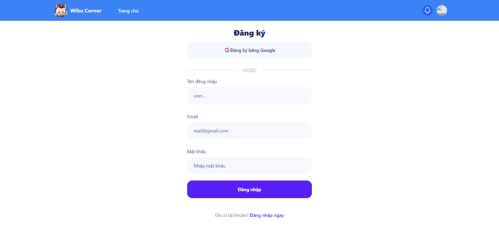
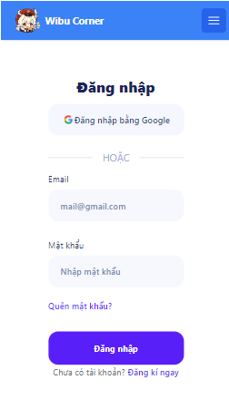
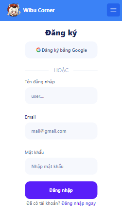

# FRONTEND SIDE


### Table of contents 
- [1-Create **React App** with **Tailwind**](#1-create-react-app)
- [2-Installation](#2-installation)
- [3-Demo](#3-demo)
- [4-API Reference](#4-api-reference)
- [5-Other](#5-other)

## 1-Create react app

#### -1.1- Create your project

```javascript
npx create-react-app my-project
```
```javascript
cd my-project
```

#### -1.2- Install Tailwind CSS
```javascript
npm install -D tailwindcss
```
- The init command to generate your tailwind.config.js file.
```javascript
npx tailwindcss init
```

- In file **tailwind.config.js**  paste these line: 
```javascript
/** @type {import('tailwindcss').Config} */
module.exports = {
  content: [
    "./src/**/*.{js,jsx,ts,tsx}",
  ],
  theme: {
    extend: {},
  },
  plugins: [],
}
```

- Add the @tailwind directives for each of Tailwind’s layers to your **./src/index.css file**.

```javascript
@tailwind base;
@tailwind components;
@tailwind utilities;
```


Start your build process
Run your build process with :
```javascript 
npm run start
```
Terminal

#### -1.3- Start using Tailwind in your project
Start using Tailwind’s utility classes to style your content.

            -----------EXAMPLE-----------

**App.js**

```javascript 
export default function App() {
  return (
    <h1 className="text-3xl font-bold underline">
      Hello world!
    </h1>
  )
}
```


## 2-Installation

Install my-project with npm

```bash
  npm install frontend
  cd frontend
```
### Requirements: 
    "@emotion/react": "^11.11.1",
    "@emotion/styled": "^11.11.0",
    "@headlessui/react": "^1.7.17",
    "@heroicons/react": "^2.0.18",
    "@mui/material": "^5.14.17",
    "@testing-library/jest-dom": "^5.17.0",
    "@testing-library/react": "^13.4.0",
    "@testing-library/user-event": "^13.5.0",
    "react": "^18.2.0",
    "react-alert": "^7.0.3",
    "react-dom": "^18.2.0",
    "react-router-dom": "^5.3.4",
    "react-scripts": "5.0.1",
    "web-vitals": "^2.1.4"

You can check the **package.json** file and setup with your version  **¯\ _(ツ)_/¯**


## 3-Demo

- #### Login page


- #### Signup page



| Login page responsive                                                             | Signup page responsive                                                      |
| --------------------------------------------------------------------------------- | --------------------------------------------------------------------------- |
|                                     | 

## 4-API Reference

#### Authorize Login

```http
POST /auth/login
```

| url       | method   | body                                                |
| :-------- | :------- | :-------------------------------------------------- |
| `API_BASE_URL + "/auth/login"` | `POST` | JSON.stringify(**loginRequest**) |

#### Authorize Signup

```http
POST /auth/signup
```

| url       | method   | body                                                  |
| :-------- | :------- | :---------------------------------------------------- |
| `API_BASE_URL + "/auth/signup"` | `POST` | JSON.stringify(**signupRequest**) |

#### GET Current User
```http
GET /user/me
```
| url       | method   | body                                                  |
| :-------- | :------- | :---------------------------------------------------- |
| `API_BASE_URL + "/user/me"` | `GET` |  |

## 5-Other

For support, email to **anivnmusicvideo@gmail.com**

